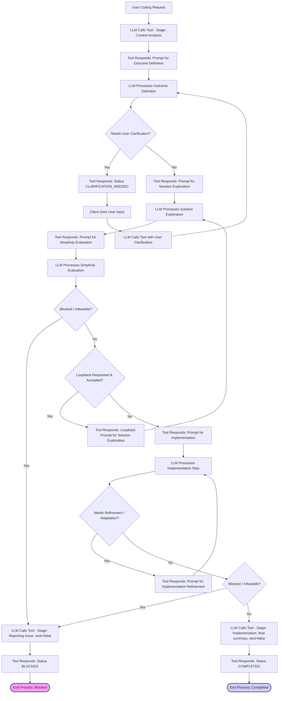

# README: Occam's Razor Thinking MCP Tool

**Version:** 1.7 (Merged with Implementation Details)
**Author:** Boris Djordjevic
**Date:** April 5, 2025
**Developed By:** [199 Longevity](https://199.bio)

## Abstract

Large Language Models (LLMs) demonstrate remarkable coding capabilities but often produce solutions that are overly complex, difficult to maintain, or subtly misaligned with user intent. This document describes the **Occam's Razor Thinking Tool**, a stateless MCP (Model Context Protocol) server component designed to mitigate these issues. It guides LLMs through a structured, sequential thinking process inspired by cognitive science and insights from LLM interpretability research, specifically Anthropic's work on Attribution Graphs [1, 2]. By enforcing distinct stages—Context Analysis, Outcome Definition, Solution Exploration, Simplicity Evaluation, and Implementation—and embedding the principle of Occam's Razor (prioritizing the simplest effective solution) throughout, the tool aims to improve the quality, simplicity, and reliability of LLM-generated code for constructive tasks. It leverages mechanisms analogous to biological processes like parallel exploration, selection pressure, developmental checkpoints, and metacognitive evaluation, translating these concepts into a practical framework for enhanced LLM-driven software development. The design explicitly addresses challenges identified in interpretability research, such as managing computational complexity, handling feature representation issues, and promoting effective goal-directed reasoning.

## Table of Contents

1.  [Introduction & Motivation](#1-introduction--motivation)
2.  [Benefits (Expanded)](#2-benefits-expanded)
3.  [Installation & Setup](#3-installation--setup)
4.  [Usage Example](#4-usage-example)
5.  [How it Works (Workflow Summary)](#5-how-it-works-workflow-summary)
    *   [The Structured Thinking Process: Stages](#51-the-structured-thinking-process-stages)
    *   [MCP Interface (Tool Definition): `occams_razor_thinking`](#52-mcp-interface-tool-definition-occams_razor_thinking)
    *   [Interaction Workflow Diagram](#53-interaction-workflow-diagram)
6.  [Core Concept: Occam's Razor for Code](#6-core-concept-occams-razor-for-code)
7.  [Scientific Rationale & Design Justification](#7-scientific-rationale--design-justification)
    *   [Leveraging LLM Internal Mechanisms](#71-leveraging-llm-internal-mechanisms)
    *   [Mapping Stages to Cognitive & Biological Analogies](#72-mapping-stages-to-cognitive--biological-analogies)
    *   [Handling Ambiguity & Errors -> Metacognition & Error Correction](#73-handling-ambiguity--errors---metacognition--error-correction)
    *   [Simplicity as a Guiding Principle -> Occam's Razor & Cognitive Load Management](#74-simplicity-as-a-guiding-principle---occams-razor--cognitive-load-management)
    *   [Acknowledging Imperfect Self-Representation](#75-acknowledging-imperfect-self-representation)
8.  [Limitations & Scope (Expanded)](#8-limitations--scope-expanded)
9.  [Development Setup](#9-development-setup)
10. [Future Work](#10-future-work)
11. [Developed By](#11-developed-by)
12. [References](#12-references)
13. [License](#13-license)

---

## 1. Introduction & Motivation

Large Language Models (LLMs) are increasingly used as powerful coding assistants. However, their unguided application often leads to suboptimal outcomes:
*   **Unnecessary Complexity:** Generating elaborate solutions when simpler, more maintainable ones exist [3].
*   **Premature Implementation:** Committing to code before fully grasping the project context or the precise desired outcomes, leading to wasted effort and misaligned results.
*   **Opacity:** The reasoning behind an LLM's chosen approach often remains unclear.
*   **Inconsistency:** Solutions may fail to align with established project patterns, constraints, or architectural principles.

The **Occam's Razor Thinking Tool** is designed to counteract these tendencies. It provides a structured cognitive workflow delivered via an MCP interface, guiding the LLM through a deliberate sequence of steps before implementation. This framework is built upon two foundational concepts:
1.  **Occam's Razor:** The philosophical principle advocating for simplicity – selecting the hypothesis (or, in this context, the software solution) with the fewest assumptions or least complexity among those that adequately explain the phenomenon (or meet the requirements).
2.  **Structured Cognition & LLM Mechanisms:** Drawing inspiration from cognitive science and LLM interpretability research, particularly the Attribution Graphs work by Anthropic [1, 2], which suggests LLMs utilize internal mechanisms analogous to planning, parallel exploration, abstraction, and metacognition. This tool aims to structure the LLM's interaction to better leverage these internal capabilities.

By integrating these concepts, the tool promotes the generation of code that is not only functional but also simple, maintainable, and well-reasoned. It achieves this through a single, stateless MCP endpoint for ease of integration.

## 2. Benefits (Expanded)

Implementing and utilizing the Occam's Razor Thinking Tool offers several significant advantages for LLM-assisted software development:

*   ✅ **Simpler, More Maintainable Code:** This is the primary goal. By explicitly evaluating solutions for simplicity across multiple dimensions (minimalism, understandability, consistency, directness, efficiency) before implementation, the tool actively steers the LLM away from unnecessarily complex solutions. This results in code that is easier for human developers to read, debug, modify, and maintain over the long term, reducing technical debt.
*   🎯 **Improved Requirement Alignment:** The mandatory `Outcome Definition` stage forces clarification of the *minimal viable* requirements upfront. This drastically reduces the risk of the LLM implementing features that weren't actually requested or misinterpreting the core goal, leading to solutions that are more precisely aligned with user intent.
*   🧩 **Enhanced Contextual Fit:** The initial `Context Analysis` stage ensures that the LLM considers the existing project's architecture, patterns, and constraints *before* proposing solutions. This leads to generated code that integrates more smoothly with the existing codebase, respects established conventions, and avoids introducing conflicting patterns or unnecessary dependencies.
*   ♻️ **Increased Reliability and Reduced Rework:** The structured, step-by-step process, including explicit evaluation and opportunities for clarification and looping back, acts as a series of checkpoints. This reduces the likelihood of fundamental misunderstandings or flawed approaches persisting until the implementation phase, thereby minimizing wasted effort and the need for significant rework. Identifying infeasibility early also saves time.
*   🤔 **Structured Reasoning and Planning:** The tool imposes a logical flow on the LLM's problem-solving process, mirroring effective human strategies (understand -> plan -> explore -> evaluate -> execute). This encourages more deliberate and robust reasoning compared to unguided, single-shot generation, leveraging the LLM's planning capabilities [1].
*    TRANSPARENCY **Process Transparency:** Each call to the tool requires the LLM to articulate its `thought` for the current stage. This sequence of thoughts creates a traceable record of the LLM's reasoning process, explaining *how* it arrived at the final solution. This transparency can be invaluable for debugging the process, understanding the rationale behind specific implementation choices, and building trust in the generated code.
*   ⚙️ **Better Use of LLM Capabilities:** The framework is designed to align with inferred LLM mechanisms [1, 2]. It explicitly prompts for parallel exploration, metacognitive evaluation (judging simplicity, identifying ambiguity), and iterative refinement, potentially leading to more effective utilization of the LLM's underlying strengths.

## 3. Installation & Setup

This server requires Node.js (version 16 or higher recommended). It is published on NPM and designed to be run via `npx`.

**Step 1: Configure Your MCP Client**

Add the following JSON block within the `"mcpServers": {}` object in your client's configuration file. Choose the file corresponding to your client and operating system:

**Configuration Block:**

```json
    "occams-razor": {
      "command": "npx",
      "args": ["occams-razor-mcp"],
      "env": {},
      "disabled": false,
      "autoApprove": []
    }
```
*(Note: Uses the simpler `npx <package_name>` format. If you encounter issues, try the more explicit format: `"args": ["--package", "occams-razor-mcp", "occams-razor-mcp"]`)*

**Client Configuration File Locations:**

*   **Claude Desktop:**
    *   macOS: `~/Library/Application Support/Claude/claude_desktop_config.json`
    *   Windows: `%APPDATA%\Claude\claude_desktop_config.json`
    *   Linux: `~/.config/Claude/claude_desktop_config.json` (Path may vary)
*   **VS Code Extension (Cline / "Claude Code"):**
    *   macOS: `~/Library/Application Support/Code/User/globalStorage/saoudrizwan.claude-dev/settings/cline_mcp_settings.json`
    *   Windows: `%APPDATA%\Code\User\globalStorage\saoudrizwan.claude-dev\settings\cline_mcp_settings.json`
    *   Linux: `~/.config/Code/User/globalStorage/saoudrizwan.claude-dev/settings/cline_mcp_settings.json`
*   **Cursor:**
    *   Global: `~/.cursor/mcp.json`
    *   Project: `.cursor/mcp.json` within your project folder.
*   **Windsurf:**
    *   `~/.codeium/windsurf/mcp_config.json`
*   **Other Clients:**
    *   Consult the specific client's documentation. The JSON structure above should generally work.

**Step 2: Restart Client**

After adding the configuration block and saving the file, fully restart your MCP client application. The first time the client starts the server, `npx` will automatically download the `occams-razor-mcp` package if needed.

## 4. Usage Example

Once installed and enabled, you can instruct your MCP client:

> "Use the Occam's Razor tool to add a basic health check endpoint at `/health` that returns a 200 OK status."

The client's AI model should recognize the intent and initiate the multi-step process by calling the `occams_razor_thinking` tool, starting with the `context_analysis` stage and proceeding through the defined workflow.

## 5. How it Works (Workflow Summary)

The interaction between the LLM client and the Occam's Razor Thinking Tool server follows a structured cycle. The tool functions as a state machine controller, guiding the LLM sequentially through the defined thinking stages. The LLM calls the tool repeatedly, providing its output ("thought") for the current stage. The tool, being stateless, uses the LLM's input (including the current stage and thought number) to determine and provide the prompt for the *next* logical step.

### 5.1. The Structured Thinking Process: Stages

The tool guides the LLM through the following mandatory stages:

1.  **Context Analysis:** The initial step focuses on understanding the environment. The LLM uses its capabilities to examine the relevant parts of the project codebase, identify architectural patterns, coding conventions, existing components, and any constraints pertinent to the user's request.
2.  **Outcome Definition:** Based on the user request and the analyzed context, the LLM precisely defines the goal. This involves specifying the *minimal viable outcome* required immediately, establishing clear success criteria, and identifying any ambiguities needing clarification.
3.  **Solution Exploration:** With a clear goal and context, the LLM generates multiple (typically 2-3) distinct potential solution approaches. This stage encourages exploring options ranging from the most direct/minimal to potentially more robust alternatives, explicitly considering the reuse of existing project elements.
4.  **Simplicity Evaluation:** This critical stage applies Occam's Razor. The LLM evaluates the explored solutions against the multifaceted criteria of simplicity and effectiveness (as detailed in Section 6), comparing trade-offs. It must justify its choice of the simplest *effective* solution and explain the rejection of alternatives, including complexities avoided.
5.  **Implementation:** The LLM proceeds to implement *only* the chosen simplest solution, focusing on adhering strictly to the plan and avoiding unnecessary additions. This stage includes a self-review step to check for further simplification opportunities and adapt to minor emergent issues or clarifications.

A final `reporting_issue` stage is entered if the LLM determines the task is blocked or infeasible.

### 5.2. MCP Interface (Tool Definition): `occams_razor_thinking`

The tool exposes a single endpoint named `occams_razor_thinking`.

**Description:** Guides systematic problem-solving for coding tasks using Occam's Razor. Breaks down problems into sequential steps (Context, Outcome, Explore, Evaluate, Implement) prioritizing simplicity. Call this tool sequentially, providing your 'thought' (reasoning/output) for the current step.

**Input Parameters:** (Refer to `src/types.ts` or the original PRD for full schema details)

*   `thought` (string, required): Detailed thinking/analysis for the current stage.
*   `thought_number` (integer, required): Sequential number of the thought (starts at 1).
*   `thinking_stage` (enum, required): The current stage (`context_analysis`, `outcome_definition`, etc.).
*   `next_thought_needed` (boolean, required): `true` to continue, `false` to terminate.
*   `user_request` (string, required on first call): The original user request.
*   `needs_clarification` (boolean, optional): Set to `true` if user input is needed.
*   `clarification_questions` (array, optional): Questions for the user if `needs_clarification` is true.
*   `user_clarification` (string, optional): User's response to previous clarification request.
*   `requested_stage_override` (enum, optional): Target stage for loopback (e.g., `solution_exploration`).
*   `issue_description` (string, optional): Summary if task is blocked/infeasible.

**Output Parameters (Tool Response):**

*   `prompt` (string): The guidance/instructions for the LLM for the *next* step or stage.
*   `status` (enum): Indicates the state of the process after this call (e.g., `CONTINUE`, `CLARIFICATION_NEEDED`, `LOOPBACK_ACCEPTED`, `COMPLETED`, `BLOCKED`, `ERROR`).

### 5.3. Interaction Workflow Diagram



**Summary of Steps:**
1.  The process starts with a user request.
2.  The LLM makes its first call to the tool, indicating the `context_analysis` stage.
3.  The tool responds with a prompt for the next stage (`outcome_definition`).
4.  The LLM performs the requested thinking for that stage, formulates its `thought`, and calls the tool again.
5.  This cycle continues through the defined stages.
6.  **Clarification Loop:** If the LLM sets `needs_clarification`, the tool returns `CLARIFICATION_NEEDED`, pausing the main flow for user input via the client, which is then passed back to the tool via `user_clarification`.
7.  **Loopback:** If evaluation suggests revisiting solutions, the LLM can request returning to an earlier stage via `requested_stage_override` (with justification in `thought`). The tool provides a targeted prompt if the loop is accepted.
8.  **Termination:** The process ends when the LLM calls with `next_thought_needed: false`, resulting in either a `COMPLETED` or `BLOCKED` status from the tool.

## 6. Core Concept: Occam's Razor for Code

Applying Occam's Razor to software development means actively choosing the simplest design and implementation that effectively fulfills the necessary requirements. In this tool's context, "simplicity" encompasses multiple dimensions evaluated explicitly during the process:
*   **Minimalism:** Does the solution avoid extraneous features, abstractions, dependencies, or code?
*   **Understandability:** Is the code easy for a human developer to read, comprehend, and modify later?
*   **Consistency:** Does the solution align with existing architectural patterns, coding styles, and conventions within the project?
*   **Directness:** Does the solution address the core requirement directly, avoiding unnecessary layers of indirection?
*   **Computational Efficiency/Directness:** Does the solution likely map to a reasonably efficient or direct computational pathway within the LLM, avoiding overly complex internal reasoning chains (inspired by findings on path lengths in circuit analysis [2])?
*   **Reuse Cost/Benefit:** Does the solution appropriately balance the simplicity gained by reusing existing components against the potential complexity of integrating or adapting them (related to concepts like exaptation [4])?

The tool enforces consideration of these factors, particularly during the dedicated `simplicity_evaluation` stage.

## 7. Scientific Rationale & Design Justification

The design choices within this tool are deliberately grounded in findings from LLM interpretability research and analogies to effective cognitive and biological processes. The aim is to create a framework that guides the LLM in a way that resonates with its internal mechanisms and promotes robust, simple problem-solving.

### 7.1. Leveraging LLM Internal Mechanisms

Interpretability techniques, such as those used to generate Attribution Graphs [1, 2], suggest LLMs utilize complex internal strategies, including:
*   **Parallel Processing:** Exploring multiple lines of reasoning concurrently [1].
*   **Planning & Goal-Directedness:** Reasoning forwards towards goals or backwards from desired outcomes [1].
*   **Abstraction & Generalization:** Identifying and applying patterns, concepts, or features across different contexts [1, 2].
*   **Metacognition:** Assessing internal states, such as confidence levels or knowledge gaps [1].
*   **Iterative Refinement:** Progressively improving intermediate representations or solutions [1].

The `occams_razor_thinking` tool structures the interaction to explicitly invoke and leverage these inferred capabilities. For instance, `Solution Exploration` taps into parallel processing, `Outcome Definition` leverages planning, `Context Analysis` relies on abstraction, and `Simplicity Evaluation` and clarification handling engage metacognitive judgment. By operating at the level of conceptual stages (e.g., 'Solution Exploration', 'Outcome Definition'), the tool prompts the LLM to synthesize information and present coherent high-level concepts, implicitly managing the potential distribution of underlying computations across many low-level features (analogous to the manual 'supernoding' required in direct circuit analysis [2]). Furthermore, guiding towards simpler solutions proactively aims to foster simpler computational pathways within the LLM itself, reducing the complexity observed in detailed circuit analyses [2].

### 7.2. Mapping Stages to Cognitive & Biological Analogies

The tool's stages can be understood through analogies to cognitive and biological processes, informed by the Attribution Graphs research [1, 2]:

*   **Stage 1: Context Analysis -> Environmental Sensing & Pattern Recognition:** Essential for any situated agent. Prompts the LLM to activate its pattern-matching and abstraction capabilities [1, 2] on the specific project environment, grounding subsequent reasoning.
*   **Stage 2: Outcome Definition -> Goal Setting & Planning:** Mirrors cognitive planning [1]. Defining the minimal viable outcome first sets a clear, simple target, preventing premature complexity and aligning with goal-directed reasoning.
*   **Stage 3: Solution Exploration -> Divergent Thinking & Parallel Exploration:** Encourages exploring multiple paths, akin to evolutionary exploration of niches or the brain's parallel processing [1]. Explicitly prompting for reuse considers **exaptation** [4] – adapting existing structures for new purposes.
*   **Stage 4: Simplicity Evaluation -> Selection Pressure, Metacognitive Judgment & Inhibition:** Acts as the core **selection pressure** (like natural selection) favoring simplicity *and* effectiveness. Requires **metacognitive** comparison [1]. Justifying rejections enforces **inhibition** of less suitable paths. Evaluating reuse cost/benefit and constraints relates to navigating **developmental constraints** [1, 4]. The prompt's detailed criteria guide this complex judgment.
*   **Stage 5: Implementation -> Focused Execution, Refinement & Plasticity:** Represents executing a chosen plan but incorporates **iterative refinement** [1] through self-review. Allowing adaptation to minor changes reflects **plasticity** (like developmental robustness) [1]. The emphasis on strict adherence counters the tendency for LLMs to deviate if competing internal pathways remain active (related to challenges in intervention fidelity [2]).

### 7.3. Handling Ambiguity & Errors -> Metacognition & Error Correction:

*   **Clarification (`needs_clarification`):** A direct application of **metacognition** [1], enabling the LLM to signal and resolve uncertainty.
*   **Loopbacks (`requested_stage_override`):** Provides **plasticity** and enables **error correction**. Requiring justification and using specialized loopback prompts referencing the *reasons* for failure creates an explicit error signal, guiding subsequent attempts more effectively, akin to **predictive coding** principles [2].

### 7.4. Simplicity as a Guiding Principle -> Occam's Razor & Cognitive Load Management:

*   **Rationale:** The entire framework is oriented around Occam's Razor. Analogous to an **energy landscape** [1], where prompts guide the LLM's state, this tool applies consistent "force" towards the desired basin representing simple, effective solutions, counteracting tendencies towards unnecessary complexity.

### 7.5. Acknowledging Imperfect Self-Representation:

*   **Rationale:** Research highlights challenges in interpreting LLM internals, including the difficulty of labeling features precisely [2] and the gap between interpretable "replacement models" and the full underlying computation ("dark matter" / reconstruction errors [2]).
*   **Design Implication:** The LLM's `thought` at each stage is treated as its best *attempt* to articulate its reasoning, likely reflecting the more structured, explainable parts of its process (analogous to a replacement model view). The tool guides based on this articulation, acknowledging it may be an imperfect or simplified summary of the full internal state.

## 8. Limitations & Scope (Expanded)

While beneficial, it's important to understand the limitations and scope of this tool:

*   💰 **Token Cost:** The most significant trade-off is increased token consumption. The multi-turn, sequential nature, requiring explicit articulation of `thought` at each step and receiving guidance prompts, inherently uses more tokens per completed task compared to a direct prompt-to-code generation. This cost must be weighed against the potential benefits of improved code quality and reduced rework.
*   🏗️ **Focus on Construction, Not Universal Application:** The tool's stages and philosophy are optimized for *constructive* coding tasks – adding new features, implementing functions or algorithms where design choices about simplicity are paramount. While the structured thinking might offer some benefit for debugging or refactoring, it's not specifically designed for those workflows, which often follow different cognitive patterns (e.g., hypothesis testing for debugging). Applying it universally might feel inefficient or unnatural for non-constructive tasks.
*   🧠 **Reliance on Underlying LLM Capability:** The tool acts as a guide and orchestrator; it does not enhance the LLM's fundamental coding skill, knowledge, or reasoning power. The quality of the context analysis, the ingenuity of the explored solutions, the accuracy of the evaluation, and the correctness of the final implementation are still fundamentally limited by the capabilities of the specific LLM being guided. The tool structures the process but cannot guarantee a high-quality outcome if the LLM itself is inadequate for the task.
*   ❓ **Dependence on LLM Representation & "Dark Matter":** The tool guides the LLM based on its *expressed* reasoning (`thought`). Its effectiveness assumes the LLM can access and articulate the internal representations relevant to the task. If the core logic relies on computations poorly captured by the LLM's primary features or falls into its representational gaps ("dark matter" or high reconstruction error scenarios identified in interpretability research [2]), the guidance based on the articulated thoughts might be less effective or even misleading.
*   👁️ **Guidance Scope Limited (Excludes QK/Attention Dynamics):** The tool primarily structures reasoning analogous to sequential processing steps (like feature processing in MLP layers). It does *not* directly address or guide the complex dynamics of attention mechanisms – *why* the model attends to certain tokens (the QK-circuit). This is a known challenge in mechanistic interpretability [1, 2]. Therefore, for tasks where the crucial reasoning step relies heavily on sophisticated attention patterns (e.g., certain types of factual recall, complex co-reference resolution), the tool's guidance on the *overall* process might be incomplete as it doesn't delve into optimizing the attention mechanism itself.
*   🗣️ **Imperfect Articulation (`thought` Parameter):** The `thought` provided by the LLM is its attempt to summarize potentially complex internal states and reasoning processes. This articulation is likely subject to the same challenges as human interpretation of LLM features [2] – it may be simplified, miss nuances, or be an imperfect reflection of the underlying computation. The tool operates on this articulated level.
*   🐌 **Potential Process Rigidity:** For very simple, routine tasks where the simplest solution is immediately obvious, the mandatory progression through all stages might feel unnecessarily bureaucratic or verbose compared to direct generation. The benefits of the structure are more pronounced for tasks with non-trivial complexity or ambiguity.

## 9. Development Setup

1.  **Clone the repository:**
    ```bash
    git clone https://github.com/199-bio/occams-razor-mcp.git
    cd occams-razor-mcp
    ```
2.  **Install dependencies:**
    ```bash
    npm install
    ```
3.  **Build the project (compile TypeScript):**
    ```bash
    npm run build
    ```
4.  **Run the server locally (using compiled code):**
    ```bash
    npm start
    ```
    Alternatively, run directly using `ts-node` or similar for development:
    ```bash
    # npm install -g ts-node (if not installed)
    # ts-node src/server.ts
    ```
    *(If running locally for development, ensure your MCP client is configured to connect to the local server address/port instead of using the `npx` command in its configuration.)*
5.  **Run tests:**
    ```bash
    npm test
    ```
6.  **Lint and Format:**
    ```bash
    npm run lint
    npm run format
    ```

## 10. Future Work

*   Allowing configuration or weighting of simplicity heuristics.
*   Implementing more sophisticated server-side logic for evaluating loopback justifications.
*   Adapting prompts dynamically based on inferred project context or task complexity.
*   Exploring integration with external static analysis or complexity measurement tools during the evaluation stage.
*   Investigating methods to better address or guide reasoning related to attention mechanisms.

## 11. Developed By

This tool was developed as part of the initiatives at **199 Longevity**, a group focused on extending the frontiers of human health and longevity.

Learn more about our work in biotechnology at [199.bio](https://199.bio).

Project contributor: Boris Djordjevic

## 12. References

[1] Olah, C., et al. (2024, February 20). *Attribution Graphs*. Transformer Circuits. URL: [https://transformer-circuits.pub/2025/attribution-graphs/](https://transformer-circuits.pub/2025/attribution-graphs/)

[2] Ameisen, E., Lindsey, J., Pearce, A., Gurnee, W., Turner, N. L., Chen, B., Citro, C., et al. (2025, March 27). *Circuit Tracing: Revealing Computational Graphs in Language Models*. Transformer Circuits. URL: [https://transformer-circuits.pub/2025/attribution-graphs/methods.html](https://transformer-circuits.pub/2025/attribution-graphs/methods.html)

[3] Olah, C., Cammarata, N., Schubert, L., Goh, G., Petrov, M., & Carter, S. (2020). Zoom In: An Introduction to Circuits. *Distill*. DOI: 10.23915/distill.00024.001

[4] Gould, S. J., & Vrba, E. S. (1982). Exaptation—a missing term in the science of form. *Paleobiology*, 8(1), 4-15.

[5] Elhage, N., Nanda, N., Olsson, C., Henighan, T., Joseph, N., Mann, B., Askell, A., Bai, Y., Chen, A., Conerly, T., DasSarma, N., Drain, D., Ganguli, D., Hatfield-Dodds, Z., Hernandez, D., Jones, A., Kernion, J., Lovitt, L., Ndousse, K., Amodei, D., Brown, T., Clark, J., Kaplan, J., McCandlish, S., & Olah, C. (2021). *A Mathematical Framework for Transformer Circuits*. Transformer Circuits Thread. URL: [https://transformer-circuits.pub/2021/framework/index.html](https://transformer-circuits.pub/2021/framework/index.html)

[6] Elhage, N., Hume, T., Olsson, C., Schiefer, N., Henighan, T., Kravec, S., Hatfield-Dodds, Z., Lasenby, R., Drain, D., Chen, C., Grosse, R., McCandlish, S., Kaplan, J., Amodei, D., Wattenberg, M., & Olah, C. (2022). *Toy Models of Superposition*. Transformer Circuits Thread. URL: [https://transformer-circuits.pub/2022/toy_model/index.html](https://transformer-circuits.pub/2022/toy_model/index.html)

[7] Dunefsky, J., Chlenski, P., & Nanda, N. (2025). Transcoders find interpretable LLM feature circuits. *Advances in Neural Information Processing Systems, 37*, 24375–24410.

[8] Nikankin, Y., Reusch, A., Mueller, A., & Belinkov, Y. (2024). *Arithmetic Without Algorithms: Language Models Solve Math With a Bag of Heuristics*. arXiv preprint arXiv:2405.01712.

[9] Bills, S., Cammarata, N., Mossing, D., Tillman, H., Gao, L., Goh, G., Sutskever, I., Leike, J., Wu, J., & Saunders, W. (2023). *Language models can explain neurons in language models*. OpenAI Blog. URL: [https://openai.com/research/language-models-can-explain-neurons-in-language-models](https://openai.com/research/language-models-can-explain-neurons-in-language-models)

[10] Miller, J., Chughtai, B., & Saunders, W. (2024). *Transformer circuit faithfulness metrics are not robust*. arXiv preprint arXiv:2407.08734.

## 13. License

```
MIT License

Copyright (c) 2025 Boris Djordjevic

Permission is hereby granted, free of charge, to any person obtaining a copy
of this software and associated documentation files (the "Software"), to deal
in the Software without restriction, including without limitation the rights
to use, copy, modify, merge, publish, distribute, sublicense, and/or sell
copies of the Software, and to permit persons to whom the Software is
furnished to do so, subject to the following conditions:

The above copyright notice and this permission notice shall be included in all
copies or substantial portions of the Software.

THE SOFTWARE IS PROVIDED "AS IS", WITHOUT WARRANTY OF ANY KIND, EXPRESS OR
IMPLIED, INCLUDING BUT NOT LIMITED TO THE WARRANTIES OF MERCHANTABILITY,
FITNESS FOR A PARTICULAR PURPOSE AND NONINFRINGEMENT. IN NO EVENT SHALL THE
AUTHORS OR COPYRIGHT HOLDERS BE LIABLE FOR ANY CLAIM, DAMAGES OR OTHER
LIABILITY, WHETHER IN AN ACTION OF CONTRACT, TORT OR OTHERWISE, ARISING FROM,
OUT OF OR IN CONNECTION WITH THE SOFTWARE OR THE USE OR OTHER DEALINGS IN THE
SOFTWARE.
``` Tool_Resp_Complete --> End_Complete([End Process: Completed]);

    style End_Blocked fill:#f9f,stroke:#333,stroke-width:2px;
    style End_Complete fill:#ccf,stroke:#333,stroke-width:2px;
```

**Summary of Steps:**
1.  The process starts with a user request.
2.  The LLM makes its first call to the tool, indicating the `context_analysis` stage.
3.  The tool responds with a prompt for the next stage (`outcome_definition`).
4.  The LLM performs the requested thinking for that stage, formulates its `thought`, and calls the tool again.
5.  This cycle continues through the defined stages.
6.  **Clarification Loop:** If the LLM sets `needs_clarification`, the tool returns `CLARIFICATION_NEEDED`, pausing the main flow for user input via the client, which is then passed back to the tool via `user_clarification`.
7.  **Loopback:** If evaluation suggests revisiting solutions, the LLM can request returning to an earlier stage via `requested_stage_override` (with justification in `thought`). The tool provides a targeted prompt if the loop is accepted.
8.  **Termination:** The process ends when the LLM calls with `next_thought_needed: false`, resulting in either a `COMPLETED` or `BLOCKED` status from the tool.

## 6. Core Concept: Occam's Razor for Code

Applying Occam's Razor to software development means actively choosing the simplest design and implementation that effectively fulfills the necessary requirements. In this tool's context, "simplicity" encompasses multiple dimensions evaluated explicitly during the process:
*   **Minimalism:** Does the solution avoid extraneous features, abstractions, dependencies, or code?
*   **Understandability:** Is the code easy for a human developer to read, comprehend, and modify later?
*   **Consistency:** Does the solution align with existing architectural patterns, coding styles, and conventions within the project?
*   **Directness:** Does the solution address the core requirement directly, avoiding unnecessary layers of indirection?
*   **Computational Efficiency/Directness:** Does the solution likely map to a reasonably efficient or direct computational pathway within the LLM, avoiding overly complex internal reasoning chains (inspired by findings on path lengths in circuit analysis [2])?
*   **Reuse Cost/Benefit:** Does the solution appropriately balance the simplicity gained by reusing existing components against the potential complexity of integrating or adapting them (related to concepts like exaptation [4])?

The tool enforces consideration of these factors, particularly during the dedicated `simplicity_evaluation` stage.

## 7. Scientific Rationale & Design Justification

The design choices within this tool are deliberately grounded in findings from LLM interpretability research and analogies to effective cognitive and biological processes. The aim is to create a framework that guides the LLM in a way that resonates with its internal mechanisms and promotes robust, simple problem-solving.

### 7.1. Leveraging LLM Internal Mechanisms

Interpretability techniques, such as those used to generate Attribution Graphs [1, 2], suggest LLMs utilize complex internal strategies, including:
*   **Parallel Processing:** Exploring multiple lines of reasoning concurrently [1].
*   **Planning & Goal-Directedness:** Reasoning forwards towards goals or backwards from desired outcomes [1].
*   **Abstraction & Generalization:** Identifying and applying patterns, concepts, or features across different contexts [1, 2].
*   **Metacognition:** Assessing internal states, such as confidence levels or knowledge gaps [1].
*   **Iterative Refinement:** Progressively improving intermediate representations or solutions [1].

The `occams_razor_thinking` tool structures the interaction to explicitly invoke and leverage these inferred capabilities. For instance, `Solution Exploration` taps into parallel processing, `Outcome Definition` leverages planning, `Context Analysis` relies on abstraction, and `Simplicity Evaluation` and clarification handling engage metacognitive judgment. By operating at the level of conceptual stages (e.g., 'Solution Exploration', 'Outcome Definition'), the tool prompts the LLM to synthesize information and present coherent high-level concepts, implicitly managing the potential distribution of underlying computations across many low-level features (analogous to the manual 'supernoding' required in direct circuit analysis [2]). Furthermore, guiding towards simpler solutions proactively aims to foster simpler computational pathways within the LLM itself, reducing the complexity observed in detailed circuit analyses [2].

### 7.2. Mapping Stages to Cognitive & Biological Analogies

The tool's stages can be understood through analogies to cognitive and biological processes, informed by the Attribution Graphs research [1, 2]:

*   **Stage 1: Context Analysis -> Environmental Sensing & Pattern Recognition:** Essential for any situated agent. Prompts the LLM to activate its pattern-matching and abstraction capabilities [1, 2] on the specific project environment, grounding subsequent reasoning.
*   **Stage 2: Outcome Definition -> Goal Setting & Planning:** Mirrors cognitive planning [1]. Defining the minimal viable outcome first sets a clear, simple target, preventing premature complexity and aligning with goal-directed reasoning.
*   **Stage 3: Solution Exploration -> Divergent Thinking & Parallel Exploration:** Encourages exploring multiple paths, akin to evolutionary exploration of niches or the brain's parallel processing [1]. Explicitly prompting for reuse considers **exaptation** [4] – adapting existing structures for new purposes.
*   **Stage 4: Simplicity Evaluation -> Selection Pressure, Metacognitive Judgment & Inhibition:** Acts as the core **selection pressure** (like natural selection) favoring simplicity *and* effectiveness. Requires **metacognitive** comparison [1]. Justifying rejections enforces **inhibition** of less suitable paths. Evaluating reuse cost/benefit and constraints relates to navigating **developmental constraints** [1, 4]. The prompt's detailed criteria guide this complex judgment.
*   **Stage 5: Implementation -> Focused Execution, Refinement & Plasticity:** Represents executing a chosen plan but incorporates **iterative refinement** [1] through self-review. Allowing adaptation to minor changes reflects **plasticity** (like developmental robustness) [1]. The emphasis on strict adherence counters the tendency for LLMs to deviate if competing internal pathways remain active (related to challenges in intervention fidelity [2]).

### 7.3. Handling Ambiguity & Errors -> Metacognition & Error Correction:

*   **Clarification (`needs_clarification`):** A direct application of **metacognition** [1], enabling the LLM to signal and resolve uncertainty.
*   **Loopbacks (`requested_stage_override`):** Provides **plasticity** and enables **error correction**. Requiring justification and using specialized loopback prompts referencing the *reasons* for failure creates an explicit error signal, guiding subsequent attempts more effectively, akin to **predictive coding** principles [2].

### 7.4. Simplicity as a Guiding Principle -> Occam's Razor & Cognitive Load Management:

*   **Rationale:** The entire framework is oriented around Occam's Razor. Analogous to an **energy landscape** [1], where prompts guide the LLM's state, this tool applies consistent "force" towards the desired basin representing simple, effective solutions, counteracting tendencies towards unnecessary complexity.

### 7.5. Acknowledging Imperfect Self-Representation:

*   **Rationale:** Research highlights challenges in interpreting LLM internals, including the difficulty of labeling features precisely [2] and the gap between interpretable "replacement models" and the full underlying computation ("dark matter" / reconstruction errors [2]).
*   **Design Implication:** The LLM's `thought` at each stage is treated as its best *attempt* to articulate its reasoning, likely reflecting the more structured, explainable parts of its process (analogous to a replacement model view). The tool guides based on this articulation, acknowledging it may be an imperfect or simplified summary of the full internal state.

## 8. Limitations & Scope (Expanded)

While beneficial, it's important to understand the limitations and scope of this tool:

*   💰 **Token Cost:** The most significant trade-off is increased token consumption. The multi-turn, sequential nature, requiring explicit articulation of `thought` at each step and receiving guidance prompts, inherently uses more tokens per completed task compared to a direct prompt-to-code generation. This cost must be weighed against the potential benefits of improved code quality and reduced rework.
*   🏗️ **Focus on Construction, Not Universal Application:** The tool's stages and philosophy are optimized for *constructive* coding tasks – adding new features, implementing functions or algorithms where design choices about simplicity are paramount. While the structured thinking might offer some benefit for debugging or refactoring, it's not specifically designed for those workflows, which often follow different cognitive patterns (e.g., hypothesis testing for debugging). Applying it universally might feel inefficient or unnatural for non-constructive tasks.
*   🧠 **Reliance on Underlying LLM Capability:** The tool acts as a guide and orchestrator; it does not enhance the LLM's fundamental coding skill, knowledge, or reasoning power. The quality of the context analysis, the ingenuity of the explored solutions, the accuracy of the evaluation, and the correctness of the final implementation are still fundamentally limited by the capabilities of the specific LLM being guided. The tool structures the process but cannot guarantee a high-quality outcome if the LLM itself is inadequate for the task.
*   ❓ **Dependence on LLM Representation & "Dark Matter":** The tool guides the LLM based on its *expressed* reasoning (`thought`). Its effectiveness assumes the LLM can access and articulate the internal representations relevant to the task. If the core logic relies on computations poorly captured by the LLM's primary features or falls into its representational gaps ("dark matter" or high reconstruction error scenarios identified in interpretability research [2]), the guidance based on the articulated thoughts might be less effective or even misleading.
*   👁️ **Guidance Scope Limited (Excludes QK/Attention Dynamics):** The tool primarily structures reasoning analogous to sequential processing steps (like feature processing in MLP layers). It does *not* directly address or guide the complex dynamics of attention mechanisms – *why* the model attends to certain tokens (the QK-circuit). This is a known challenge in mechanistic interpretability [1, 2]. Therefore, for tasks where the crucial reasoning step relies heavily on sophisticated attention patterns (e.g., certain types of factual recall, complex co-reference resolution), the tool's guidance on the *overall* process might be incomplete as it doesn't delve into optimizing the attention mechanism itself.
*   🗣️ **Imperfect Articulation (`thought` Parameter):** The `thought` provided by the LLM is its attempt to summarize potentially complex internal states and reasoning processes. This articulation is likely subject to the same challenges as human interpretation of LLM features [2] – it may be simplified, miss nuances, or be an imperfect reflection of the underlying computation. The tool operates on this articulated level.
*   🐌 **Potential Process Rigidity:** For very simple, routine tasks where the simplest solution is immediately obvious, the mandatory progression through all stages might feel unnecessarily bureaucratic or verbose compared to direct generation. The benefits of the structure are more pronounced for tasks with non-trivial complexity or ambiguity.

## 9. Development Setup

1.  **Clone the repository:**
    ```bash
    git clone https://github.com/199-bio/occams-razor-mcp.git
    cd occams-razor-mcp
    ```
2.  **Install dependencies:**
    ```bash
    npm install
    ```
3.  **Build the project (compile TypeScript):**
    ```bash
    npm run build
    ```
4.  **Run the server locally (using compiled code):**
    ```bash
    npm start
    ```
    Alternatively, run directly using `ts-node` or similar for development:
    ```bash
    # npm install -g ts-node (if not installed)
    # ts-node src/server.ts
    ```
    *(If running locally for development, ensure your MCP client is configured to connect to the local server address/port instead of using the `npx` command in its configuration.)*
5.  **Run tests:**
    ```bash
    npm test
    ```
6.  **Lint and Format:**
    ```bash
    npm run lint
    npm run format
    ```

## 10. Future Work

*   Allowing configuration or weighting of simplicity heuristics.
*   Implementing more sophisticated server-side logic for evaluating loopback justifications.
*   Adapting prompts dynamically based on inferred project context or task complexity.
*   Exploring integration with external static analysis or complexity measurement tools during the evaluation stage.
*   Investigating methods to better address or guide reasoning related to attention mechanisms.

## 11. Developed By

This tool was developed as part of the initiatives at **199 Longevity**, a group focused on extending the frontiers of human health and longevity.

Learn more about our work in biotechnology at [199.bio](https://199.bio).

Project contributor: Boris Djordjevic

## 12. References

[1] Olah, C., et al. (2024, February 20). *Attribution Graphs*. Transformer Circuits. URL: [https://transformer-circuits.pub/2025/attribution-graphs/](https://transformer-circuits.pub/2025/attribution-graphs/)

[2] Ameisen, E., Lindsey, J., Pearce, A., Gurnee, W., Turner, N. L., Chen, B., Citro, C., et al. (2025, March 27). *Circuit Tracing: Revealing Computational Graphs in Language Models*. Transformer Circuits. URL: [https://transformer-circuits.pub/2025/attribution-graphs/methods.html](https://transformer-circuits.pub/2025/attribution-graphs/methods.html)

[3] Olah, C., Cammarata, N., Schubert, L., Goh, G., Petrov, M., & Carter, S. (2020). Zoom In: An Introduction to Circuits. *Distill*. DOI: 10.23915/distill.00024.001

[4] Gould, S. J., & Vrba, E. S. (1982). Exaptation—a missing term in the science of form. *Paleobiology*, 8(1), 4-15.

[5] Elhage, N., Nanda, N., Olsson, C., Henighan, T., Joseph, N., Mann, B., Askell, A., Bai, Y., Chen, A., Conerly, T., DasSarma, N., Drain, D., Ganguli, D., Hatfield-Dodds, Z., Hernandez, D., Jones, A., Kernion, J., Lovitt, L., Ndousse, K., Amodei, D., Brown, T., Clark, J., Kaplan, J., McCandlish, S., & Olah, C. (2021). *A Mathematical Framework for Transformer Circuits*. Transformer Circuits Thread. URL: [https://transformer-circuits.pub/2021/framework/index.html](https://transformer-circuits.pub/2021/framework/index.html)

[6] Elhage, N., Hume, T., Olsson, C., Schiefer, N., Henighan, T., Kravec, S., Hatfield-Dodds, Z., Lasenby, R., Drain, D., Chen, C., Grosse, R., McCandlish, S., Kaplan, J., Amodei, D., Wattenberg, M., & Olah, C. (2022). *Toy Models of Superposition*. Transformer Circuits Thread. URL: [https://transformer-circuits.pub/2022/toy_model/index.html](https://transformer-circuits.pub/2022/toy_model/index.html)

[7] Dunefsky, J., Chlenski, P., & Nanda, N. (2025). Transcoders find interpretable LLM feature circuits. *Advances in Neural Information Processing Systems, 37*, 24375–24410.

[8] Nikankin, Y., Reusch, A., Mueller, A., & Belinkov, Y. (2024). *Arithmetic Without Algorithms: Language Models Solve Math With a Bag of Heuristics*. arXiv preprint arXiv:2405.01712.

[9] Bills, S., Cammarata, N., Mossing, D., Tillman, H., Gao, L., Goh, G., Sutskever, I., Leike, J., Wu, J., & Saunders, W. (2023). *Language models can explain neurons in language models*. OpenAI Blog. URL: [https://openai.com/research/language-models-can-explain-neurons-in-language-models](https://openai.com/research/language-models-can-explain-neurons-in-language-models)

[10] Miller, J., Chughtai, B., & Saunders, W. (2024). *Transformer circuit faithfulness metrics are not robust*. arXiv preprint arXiv:2407.08734.

## 13. License

```
MIT License

Copyright (c) 2025 Boris Djordjevic

Permission is hereby granted, free of charge, to any person obtaining a copy
of this software and associated documentation files (the "Software"), to deal
in the Software without restriction, including without limitation the rights
to use, copy, modify, merge, publish, distribute, sublicense, and/or sell
copies of the Software, and to permit persons to whom the Software is
furnished to do so, subject to the following conditions:

The above copyright notice and this permission notice shall be included in all
copies or substantial portions of the Software.

THE SOFTWARE IS PROVIDED "AS IS", WITHOUT WARRANTY OF ANY KIND, EXPRESS OR
IMPLIED, INCLUDING BUT NOT LIMITED TO THE WARRANTIES OF MERCHANTABILITY,
FITNESS FOR A PARTICULAR PURPOSE AND NONINFRINGEMENT. IN NO EVENT SHALL THE
AUTHORS OR COPYRIGHT HOLDERS BE LIABLE FOR ANY CLAIM, DAMAGES OR OTHER
LIABILITY, WHETHER IN AN ACTION OF CONTRACT, TORT OR OTHERWISE, ARISING FROM,
OUT OF OR IN CONNECTION WITH THE SOFTWARE OR THE USE OR OTHER DEALINGS IN THE
SOFTWARE.
```